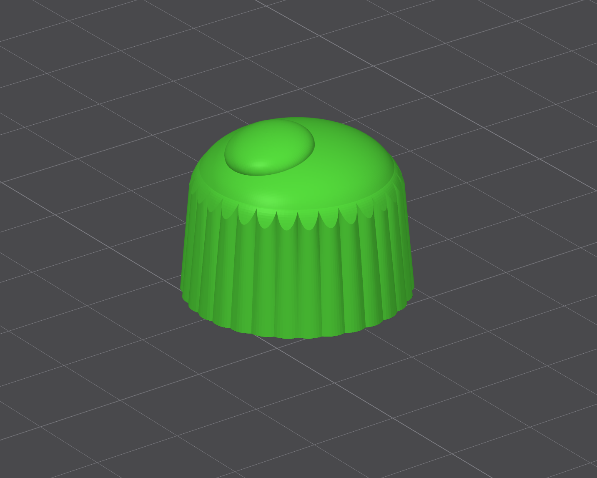
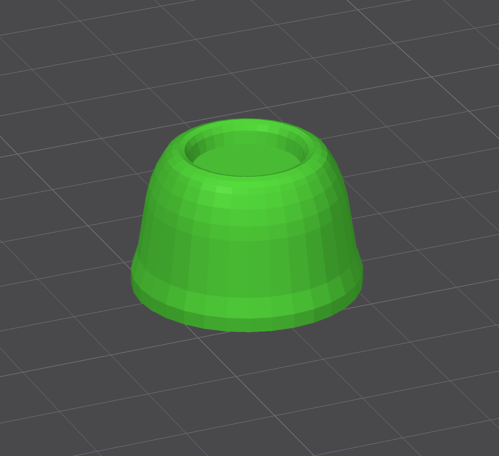
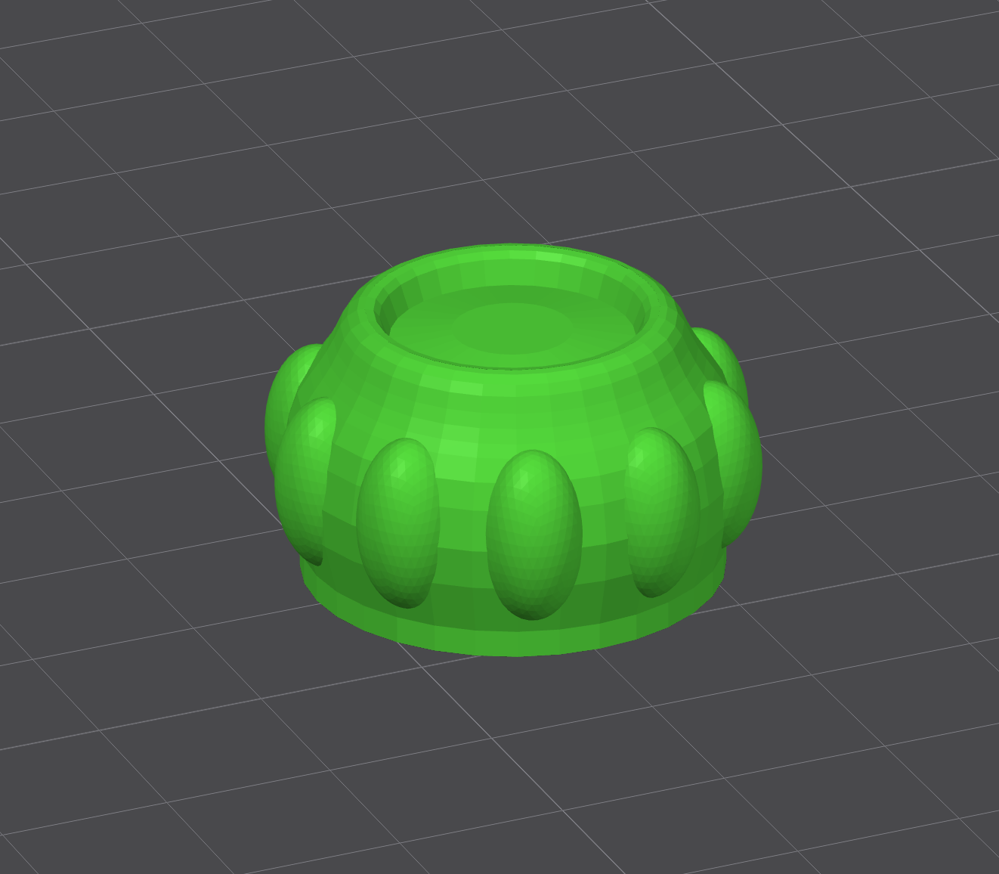
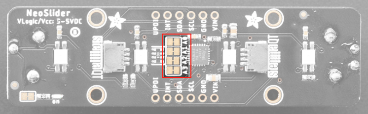
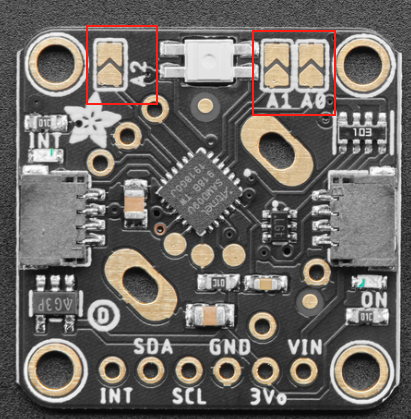
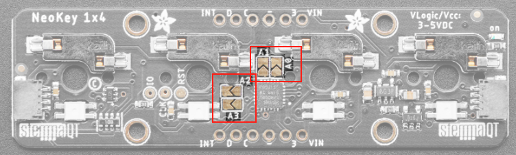

# Project setup - Hardware

## 3D Printing

In this project, I have designed a custom case along with custom slider and rotary caps.

### Case

### Rotary encoder caps

I have not designed the rotary encoder caps from the ground up. Instead I have used freely available models and customized them to my liking.

In my project, the rotary encoders represent different parts of a face: eyes, nose holes and ear rings.

#### Print settings

In order to get fine details of the controller, I have set the layer height to the lowest possible setting.

In order to get good stability, I have set the infill density to a higher value.
TODO: add print settings(layer height, dense infill, no supports)

#### Eyes

> Base model: [thingiverse.com - Knob D shape rotary encoder by nanoBorg88](https://www.thingiverse.com/thing:3904056)

The 3d print file (STL) for the rotary encoder cap of the eyes can be found here: [Eyeknob_1.stl](./3d-print-parts/Eyeknob_1.stl)

Dimensions: 24.64mm x 24.52mm x 19.21mm

Number of parts required: 2

#### Nose Holes

> Base model: [thingiverse.com - Rotary Encoder Knob by fsda23](https://www.thingiverse.com/thing:5262791)

The 3d print file (STL) for the rotary encoder cap of the nose holes can be found here: [NoseRotary.stl](./3d-print-parts/NoseRotary.stl)

Dimensions: 24.75mm x 24.75mm x 15.72mm

Number of parts required: 2

#### Ear rings

> Base model: [thingiverse.com - Rotary Encoder Knob by fsda23](https://www.thingiverse.com/thing:5262791)

The 3d print file (STL) for the rotary encoder cap of the ear rings can be found here: [EarringRotary.stl](./3d-print-parts/EarringRotary.stl)

Dimensions: 29.36mm x 28.26mm x 16.36mm

Number of parts required: 2

### Slider caps

## Setting I2C addresses

## Connecting components

## Configuring the I2C addresses

As we need to have a unique I2C address for each component, these have to be set on the hardware. The Adafruit components that I use have address jumpers to do this.

The possible I2c addresses are:
- Slider: 0x30 - 0x3F (0x30, 0x31, 0x32, 0x33, 0x34, 0x35, 0x36, 0x37, 0x38, 0x39, 0x3A, 0x3B, 0x3C, 0x3D, 0x3E, 0x3F)
- Rotary Encoder: 0x36 - 0x3D (0x36, 0x37, 0x38, 0x39, 0x3A, 0x3B, 0x3C, 0x3D)
- Keys: 0x30 - 0x3F (0x30, 0x31, 0x32, 0x33, 0x34, 0x35, 0x36, 0x37, 0x38, 0x39, 0x3A, 0x3B, 0x3C, 0x3D, 0x3E, 0x3F)

### I2C address definition

| Component        | Address |
| ---------------- | ------- |
| Slider 1         | 0x30    |
| Slider 2         | 0x31    |
| Rotary Encoder 1 | 0x36    |
| Rotary Encoder 2 | 0x37    |
| Rotary Encoder 3 | 0x38    |
| Rotary Encoder 4 | 0x39    |
| Rotary Encoder 5 | 0x3A    |
| Rotary Encoder 6 | 0x3B    |
| Keys 1           | 0x32    |
| Keys 2           | 0x33    |

### Slider address jumpers

> Guide for address jumpers: [learn.adafruit.com - Adafruit NeoSlider Address Jumpers](https://learn.adafruit.com/adafruit-neoslider/pinouts#address-jumpers-3107357)

The slider has four address jumpers. The default address of the slider is 0x30, which means that all the address jumpers are closed (not cut). By cutting the address jumpers, we add bits to the base of 0x30. In that way, we can achieve the addresses as layed out below:

| Component | Address | A0  | A1  | A2  | A3  |
| --------- | ------- | --- | --- | --- | --- |
| Slider 1  | 0x30    | L   | L   | L   | L   |
| Slider 2  | 0x31    | H   | L   | L   | L   |
|           | 0x32    | L   | H   | L   | L   |
|           | 0x33    | H   | H   | L   | L   |
|           | 0x34    | L   | L   | H   | L   |
|           | 0x35    | H   | L   | H   | L   |
|           | 0x36    | L   | H   | H   | L   |
|           | 0x37    | H   | H   | H   | L   |
|           | 0x38    | L   | L   | L   | H   |
|           | 0x39    | H   | L   | L   | H   |
|           | 0x3A    | L   | H   | L   | H   |
|           | 0x3B    | H   | H   | L   | H   |
|           | 0x3C    | L   | L   | H   | H   |
|           | 0x3D    | H   | L   | H   | H   |
|           | 0x3E    | L   | H   | H   | H   |
|           | 0x3F    | H   | H   | H   | H   |

- L -> low -> closed -> not cut
- H -> high -> open -> cut

### Rotary encoder address jumpers

> Guide for address jumpers: [learn.adafruit.com - Adafruit I2C QT Rotary Encoder Address Jumpers](https://learn.adafruit.com/adafruit-i2c-qt-rotary-encoder/pinouts#address-jumpers-3096023)

The rotary encoders have three address jumpers, which can be left open (not soldered) or closed (soldered). To default address of the rotary encoders is 0x36, which means that all the address jumpers are open (not soldered). By soldering the address jumpers, we add bits to the base of 0x36. In that way, we can achieve the addresses as layed out below:

| Component        | Address | A0  | A1  | A2  |
| ---------------- | ------- | --- | --- | --- |
| Rotary Encoder 1 | 0x36    | H   | H   | H   |
| Rotary Encoder 2 | 0x37    | L   | H   | H   |
| Rotary Encoder 3 | 0x38    | H   | L   | H   |
| Rotary Encoder 4 | 0x39    | L   | L   | H   |
| Rotary Encoder 5 | 0x3A    | H   | H   | L   |
| Rotary Encoder 6 | 0x3B    | L   | H   | L   |
|                  | 0x3C    | H   | L   | L   |
|                  | 0x3D    | L   | L   | L   |

- L -> low -> closed -> soldered
- H -> high -> open -> not soldered

### Keys address jumpers

> Guide for address jumpers: [learn.adafruit.com - Adafruit NeoKey Address Jumpers](https://learn.adafruit.com/neokey-1x4-qt-i2c/pinouts#address-jumpers-3098419)

The keys have four address jumpers, which can be left open (not soldered) or closed (soldered). The default address of the keys is 0x30, which means that all the address jumpers are open (not soldered). By soldering the address jumpers, we add bits to the base of 0x30. In that way, we can achieve the addresses as layed out below:

| Component | Address | A0  | A1  | A2  | A3  |
| --------- | ------- | --- | --- | --- | --- |
|           | 0x30    | L   | L   | L   | L   |
|           | 0x31    | H   | L   | L   | L   |
| Keys 1    | 0x32    | L   | H   | L   | L   |
| Keys 2    | 0x33    | H   | H   | L   | L   |
|           | 0x34    | L   | L   | H   | L   |
|           | 0x35    | H   | L   | H   | L   |
|           | 0x36    | L   | H   | H   | L   |
|           | 0x37    | H   | H   | H   | L   |
|           | 0x38    | L   | L   | L   | H   |
|           | 0x39    | H   | L   | L   | H   |
|           | 0x3A    | L   | H   | L   | H   |
|           | 0x3B    | H   | H   | L   | H   |
|           | 0x3C    | L   | L   | H   | H   |
|           | 0x3D    | H   | L   | H   | H   |
|           | 0x3E    | L   | H   | H   | H   |
|           | 0x3F    | H   | H   | H   | H   |

- L -> low -> open -> not soldered
- H -> high -> closed -> soldered

## Helpful things I learned

### How much power does a NeoPixel use/require

NeoPixels can draw up to 60 milliamps, meaning each pixel draws about 20 milliamps. If we want to display full bright white, the full 60 milliamps will be required as each pixel needs to be lit up the same amount. If we mix colors, the required milliamps will be lower. The rule of thumb of Adafruit is to calculate with 20 milliamps. For my 22 NeoPixels (Slider: 2x4 NeoPixel, Rotary Encoder: 6x1 NeoPixel, Keys: 2x4 NeoPixel), the amps calculation looks as follows:

- Rule of thumb calculation: 22 NeoPixels x 20 mA / 1000 = 0.4 Amps minimum
- Maximum calculation: 22 NeoPixels x 60 mA / 1000 = 1.32 Amps minimum

As these are the minimum amp requirements, it is good to always leave some headroom. Keep in mind that the board, the components themselves and also onboard pixels also need power.

### How much power does my board use/require

### How to know, how much power is available by using the 3.3V pin

The NeoPixels located on my Adafruit components are normally powered via 3.3V as this is the default connection for I2C cables. The board receives 5V which is then regulated down to 3.3V. This leads to the board providing a reduced amount of (milli) amps. As a NeoPixel can draw up to 60 milliamps, this can become critical when using a significant amount of NeoPixels. In my case, there are 22 NeoPixels in total. In order to find out, how much amps each NeoPixel can use, we can look at the voltage regulator that is present on a board. The information on the voltage regulator of the board can be found by looking at the schematics. For my project, I have looked at the following two boards:

#### Waveshare ESP32-S3-DEV-KIT-N8R8

> Product link: [docs.waveshare.com - ESP32-S3-DEV-KIT-N8R8](https://docs.waveshare.com/ESP32-S3-DEV-KIT-N8R8)

#### LilyGo T7 S3

> Product Link: [lilygo.cc - T7 S3](https://lilygo.cc/en-us/products/t7-s3)

## Resources

- [learn.adafruit.com - Powering Neopixels](https://learn.adafruit.com/adafruit-neopixel-uberguide/powering-neopixels)