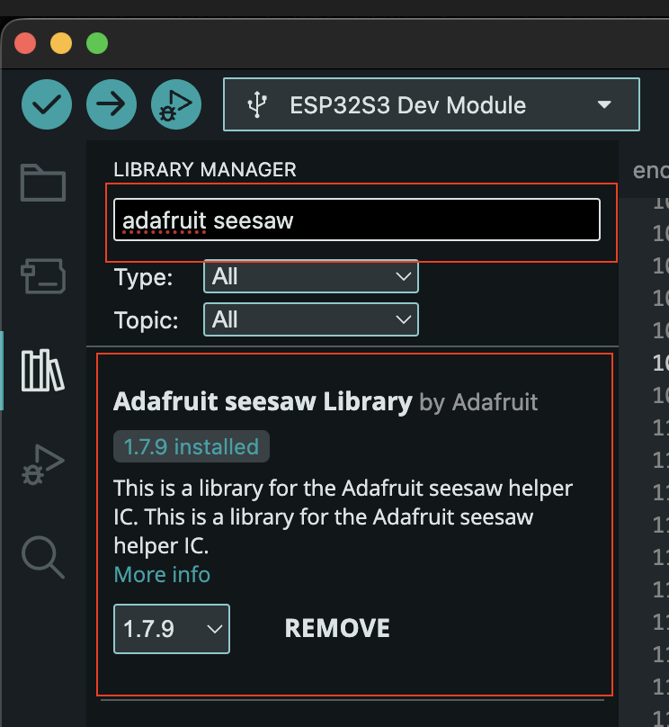
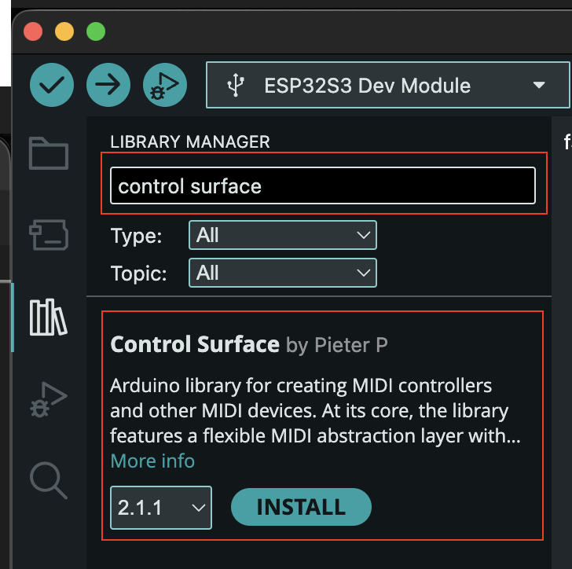
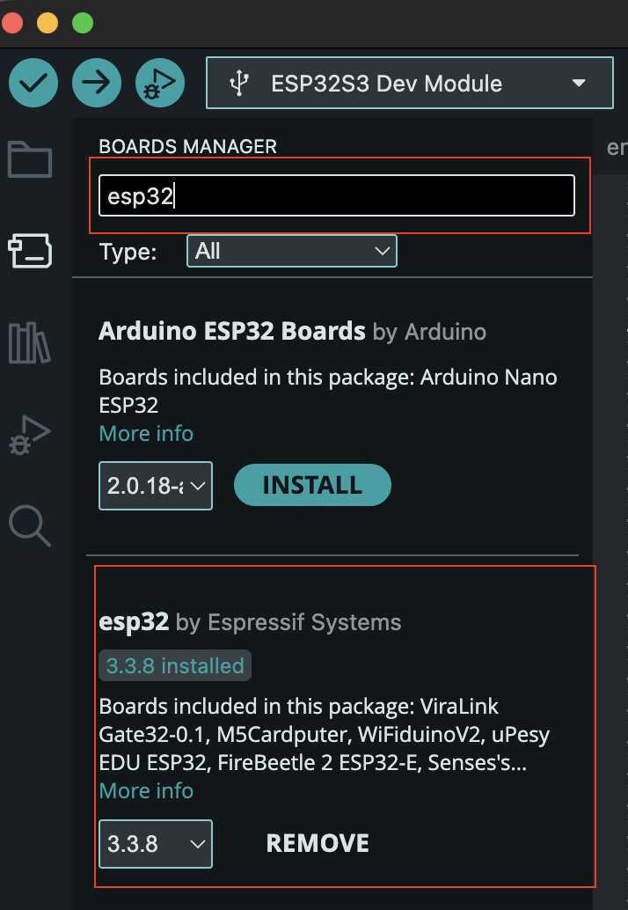
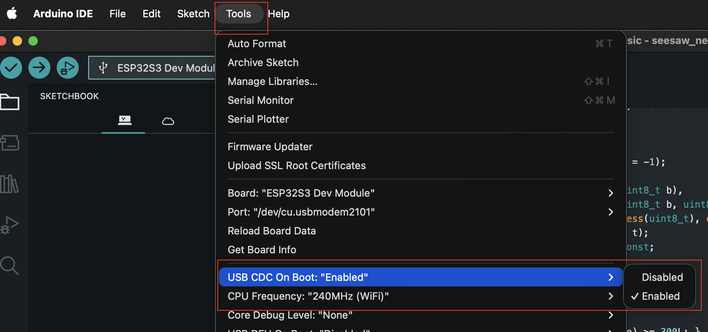

# Project Setup - Software

Below is a description of what is required to get the software of this project to work.

- [Project Setup - Software](#project-setup---software)
  - [Prerequisites](#prerequisites)
    - [Install Arduino IDE](#install-arduino-ide)
    - [Install Adafruit Seesaw library](#install-adafruit-seesaw-library)
    - [Install MIDI Library](#install-midi-library)
    - [Install ESP32 Boards](#install-esp32-boards)
    - [MIDI definition](#midi-definition)
      - [Data Value Mapping](#data-value-mapping)
      - [MIDI assignment](#midi-assignment)
  - [Troubleshooting](#troubleshooting)
    - [No serial messages received](#no-serial-messages-received)
    - [No seesaw chip found](#no-seesaw-chip-found)
  - [Resources](#resources)


## Prerequisites

In order to get started with the development, we need to set up a few things first.

### Install Arduino IDE

To develop this project, we use the Arduino IDE, as it is simple to use and can help us bundling the code correctly for our ESP32.

To install it, download it from [arduino.cc](https://www.arduino.cc/en/software/) and follow the installation process.

### Install Adafruit Seesaw library

The Adafruit components used in this project all have seesaw chips, so we need to install the seesaw library inside of the Arduino IDE to communicate with these chips.

To install it, go to the library manager and search for `adafruit seesaw` and install the library.



### Install MIDI Library

This project transmits the values of the components via MIDI over USB and MIDI over BLE. A simple library to achieve this is called [Control-Surface](https://github.com/tttapa/Control-Surface) which also supports ESP32.

To install it, go to the library manager and search for `control surface`and install the library.



### Install ESP32 Boards

As we use an ESP32 board in this project, we need to add the board configuration.

To do so, open the board manager and search for `esp32` and install the board configurations.



### MIDI definition

My layout enables me to do a MIDI mapping to two channels. Like this I can assign 3 rotary encoders, 1 slider and 4 keys to each channel.

| MIDI Channel 1           | MIDI Channel 2            |
| ------------------------ | ------------------------- |
| Left Slider              | Right Slider              |
| Left Eye Rotary Encoder  | Right Eye Rotary Encoder  |
| Left Nose Rotary Encoder | Right Nose Rotary Encoder |
| Left Ear Rotary Encoder  | Right Ear Rotary Encoder  |
| Top 4 Keys               | Bottom 4 Keys             |

#### Data Value Mapping

The values that I receive from my components need to be mapped to MIDI values. The table below lines out how this is done:

| Hardware Action    | MIDI Message Type   | Data 1 (Identification) | Data 2 (Value) |
| ------------------ | ------------------- | ----------------------- | -------------- |
| Slider Movement    | Control Change (CC) | CC Number               | 0 to 127       |
| Encoder Turn Right | Control Change (CC) | CC Number               | 1              |
| Encoder Turn Left  | Control Change (CC) | CC Number               | 127            |
| Encoder/Key Press  | Note On or CC       | Note/CC Number          | 127            |
| Encoder/Key Lift   | Note Off or CC      | Note/CC Number          | 0              |

#### MIDI assignment

Each of the components has to send unique values, the table below outlines the assigned values. This is the same for both MIDI channels.

| Component           | Control Change             | Note |
| ------------------- | -------------------------- | ---- |
| Slider              | 10                         |      |
| Eye Rotary Encoder  | 20 (Rotation), 21 (Switch) | 36   |
| Nose Rotary Encoder | 22 (Rotation), 23 (Switch) | 37   |
| Ear Rotary Encoder  | 24 (Rotation), 25 (Switch) | 38   |
| Key 1               | 26                         | 40   |
| Key 2               | 27                         | 41   |
| Key 3               | 28                         | 42   |
| Key 4               | 29                         | 43   |


## Troubleshooting

I have run into some issues in this project and here is a list of issues that I ran into, so if I run into them again, I know what the issue is and how to solve it.

### No serial messages received

I had the issue that I did not receive serial messages from my board, which sucks when trying to debug the project.

The issue was, that I had the setting `USB CDC On Boot` on `Disabled`. To receive the serial messages, set this to `Enabled`.



### No seesaw chip found

When using an ESP32, we can define the I2C pins freely and most likely, they will not be the standard I2C pins. To change this, we can set the pins manually in the Wire library and then pass the pointer of Wire to the Adafruit seesaw library.

```cpp
#define I2C_SDA 14
#define I2C_SCL 13

....

Adafruit_seesaw Sliders[2] = {
  Adafruit_seesaw(&Wire1),
  Adafruit_seesaw(&Wire1)
};

Adafruit_NeoKey_1x4 NeoKeyButtons[KEY_ROWS][KEY_COLUMNS / 4] = {
  { Adafruit_NeoKey_1x4(BUTTONS1_ADDRESS, &Wire1) },
  { Adafruit_NeoKey_1x4(BUTTONS2_ADDRESS, &Wire1) },
};

...


void setup() {
  // Set ESP32 pins manually, as they are not on the default pins
  Wire1.setPins(I2C_SDA, I2C_SCL);
}
```

## Resources

- [learn.adafruit.com - Adafruit Seesaw](https://learn.adafruit.com/adafruit-seesaw-atsamd09-breakout/overview)
- [learn.adafruit.com - Adafruit NeoSlider Arduino](https://learn.adafruit.com/adafruit-neoslider/arduino)
- [docs.waveshare.com - ESP32-S3-DEV-KIT-N8R8 Development Environment Setup Arduino](https://docs.waveshare.com/ESP32-S3-DEV-KIT-N8R8/Development-Environment-Setup-Arduino)
- [docs.waveshare.com - ESP32 Arduino IDE Setup](https://docs.waveshare.com/ESP32-Arduino-Tutorials/Arduino-IDE-Setup)
- [learn.adafruit.com - Arduino MIDI Example](https://learn.adafruit.com/adafruit-midi-featherwing/arduino-midi-example)
- [learn.adafruit.com - MIDI for Makers](https://learn.adafruit.com/midi-for-makers/overview)