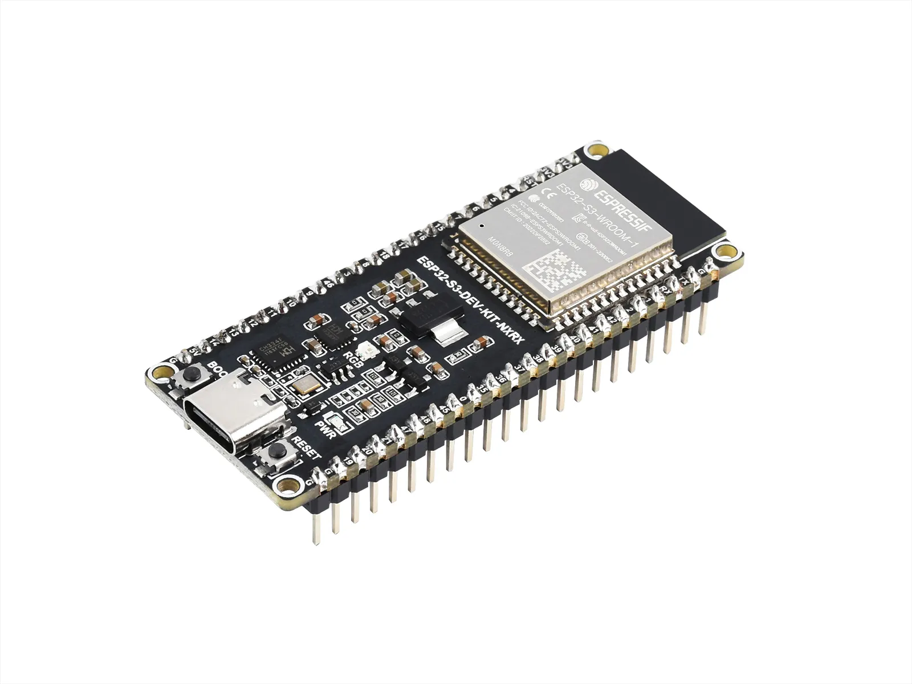
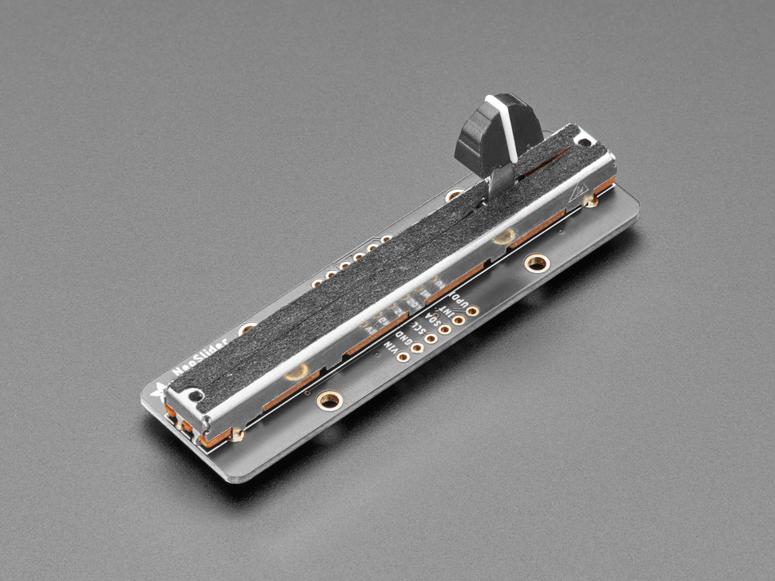
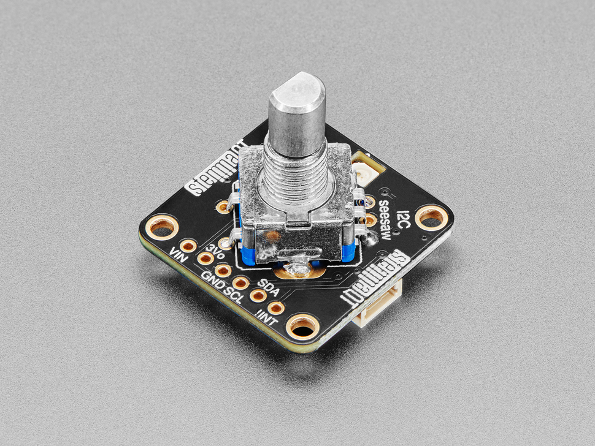
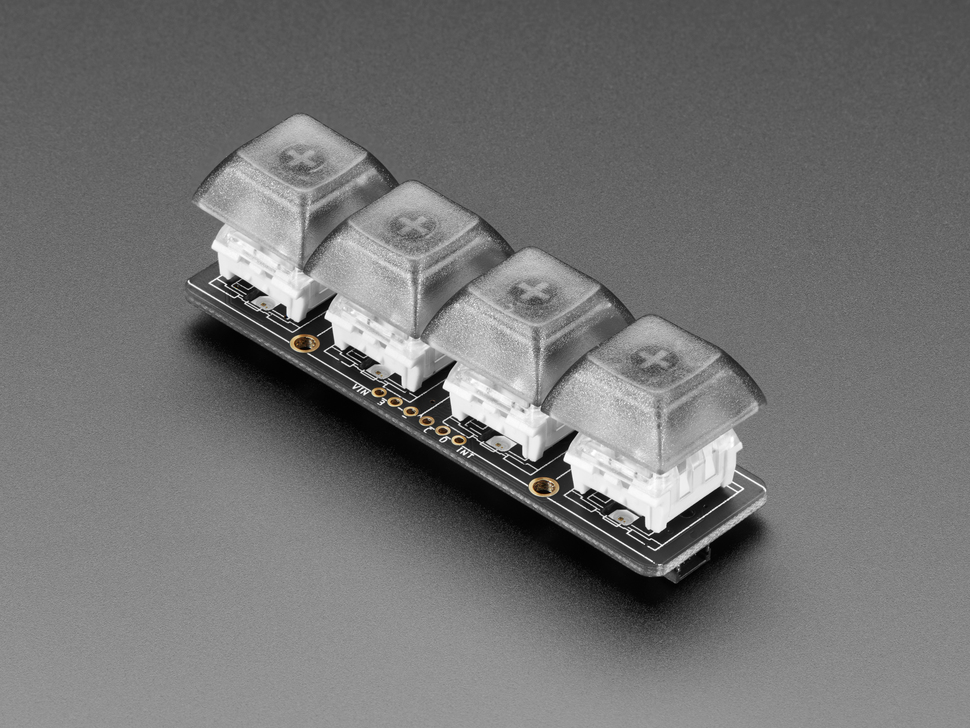

# Custom midi controller

This repository contains the code for my custom midi controller. The goal of the project is to make a face-shaped midi controller that is using I2C components and an ESP32. Code is written using Arduino IDE.

- [Custom midi controller](#custom-midi-controller)
  - [Parts used in this project](#parts-used-in-this-project)
    - [Microcontroller - Waveshare ESP32-S3](#microcontroller---waveshare-esp32-s3)
      - [Documentation](#documentation)
    - [Slide potentiometers - Adafruit NeoSlider](#slide-potentiometers---adafruit-neoslider)
      - [Documentation](#documentation-1)
    - [Rotary Encoders - Adafruit Rotary Encoder](#rotary-encoders---adafruit-rotary-encoder)
      - [Documentation](#documentation-2)
    - [Buttons - Adafruit NeoKey 1x4](#buttons---adafruit-neokey-1x4)
      - [Documentation](#documentation-3)
  - [Project setup](#project-setup)
  - [What is I2C](#what-is-i2c)
  - [Resources](#resources)

## Parts used in this project

This project makes use of components by Adafruit which are connected via I2C (STEMMAT QT / QWIIC) for controlling midi. The components are connected to an ESP32.

### Microcontroller - Waveshare ESP32-S3

> Product Link: [waveshare.com - ESP32-S3-DEV-KIT-NXRX](https://docs.waveshare.com/ESP32-S3-DEV-KIT-N8R8)

This ESP32 is used for receiving the signals from the components used, handles controlling the LEDs of the components and sends the midi signals over USB.

#### Documentation

- [waveshare.com - ESP32-S3-DEV-KIT-NXRX](https://docs.waveshare.com/ESP32-S3-DEV-KIT-N8R8)

### Slide potentiometers - Adafruit NeoSlider

> Product Link: [adafruit.com - Adafruit NeoSlider I2C QT Slide Potentiometer with 4 NeoPixels - STEMMA QT / Qwiic](https://www.adafruit.com/product/5295)

The slide potentiometers are used for representing the eyebrows of the face. I use custom slider caps. The 3D print file for these can be found [here - TODO: add link]().

The possible I2C addresses are: 0x30 - 0x3F (0x30, 0x31, 0x32, 0x33, 0x34, 0x35, 0x36, 0x37, 0x38, 0x39, 0x3A, 0x3B, 0x3C, 0x3D, 0x3E, 0x3F)

#### Documentation

- [learn.adafruit.com - Adafruit Neoslider](https://cdn-learn.adafruit.com/downloads/pdf/adafruit-neoslider.pdf)
- [learn.adafruit.com - Adafruit NeoSlider Downloads](https://learn.adafruit.com/adafruit-neoslider/downloads)

### Rotary Encoders - Adafruit Rotary Encoder

> Product Link: [Adafruit I2C Stemma QT Rotary Encoder Breakout with Encoder - STEMMA QT / Qwiic](https://www.adafruit.com/product/5880)

The rotary encoders are used for representing the eyes, noseholes and earrings of the face. I use custom encoder caps. The 3D print file for these can be found [here - TODO: add link]().

The possible I2C addresses are: 0x36 - 0x3D (0x36, 0x37, 0x38, 0x39, 0x3A, 0x3B, 0x3C, 0x3D)

#### Documentation

- [learn.adafruit.com - Adafruit I2C QT Rotary Encoder](https://cdn-learn.adafruit.com/downloads/pdf/adafruit-i2c-qt-rotary-encoder.pdf)
- [learn.adafruit.com - Adafruit I2C QT Rotary Encoder Downloads](https://learn.adafruit.com/adafruit-i2c-qt-rotary-encoder/downloads)

### Buttons - Adafruit NeoKey 1x4

> Product Link: [adafruit.com - NeoKey 1x4 QT I2C - Four Mechanical Key Switches with NeoPixels - STEMMA QT / Qwiic](https://www.adafruit.com/product/4980)

The buttons are used for representing the teeth of the face. I use standard parts for the key switches and key caps. These are:
- [adafruit.com - Kailh Mechanical Key Switches - Linear Black - 10 pack - Cherry MX Black Compatible](https://www.adafruit.com/product/4953)
- [adafruit.com - Translucent Keycaps for MX Compatible Switches - 10 pack](https://www.adafruit.com/product/4956)

The possible I2C addresses are: 0x30 - 0x3F (0x30, 0x31, 0x32, 0x33, 0x34, 0x35, 0x36, 0x37, 0x38, 0x39, 0x3A, 0x3B, 0x3C, 0x3D, 0x3E, 0x3F)

#### Documentation

- [learn.adafruit.com - NeoKey 1x4 QT I2C](https://learn.adafruit.com/neokey-1x4-qt-i2c)
- [learn.adafruit.com - NeoKey 1x4 QT I2C Downloads](https://learn.adafruit.com/neokey-1x4-qt-i2c/downloads)

## Project setup

- Install Arduino IDE
- Install ESP32 Boards
- Install Adafruit Seesaw library

## What is I2C

## Resources

- [adafruit.com - Powering Neopixels](https://learn.adafruit.com/adafruit-neopixel-uberguide/powering-neopixels)
- [adafruit.com - Adafruit STEMMA & STEMMA QT](https://learn.adafruit.com/introducing-adafruit-stemma-qt/what-is-stemma)
- [adafruit.com - I2C address list](https://learn.adafruit.com/i2c-addresses/the-list)